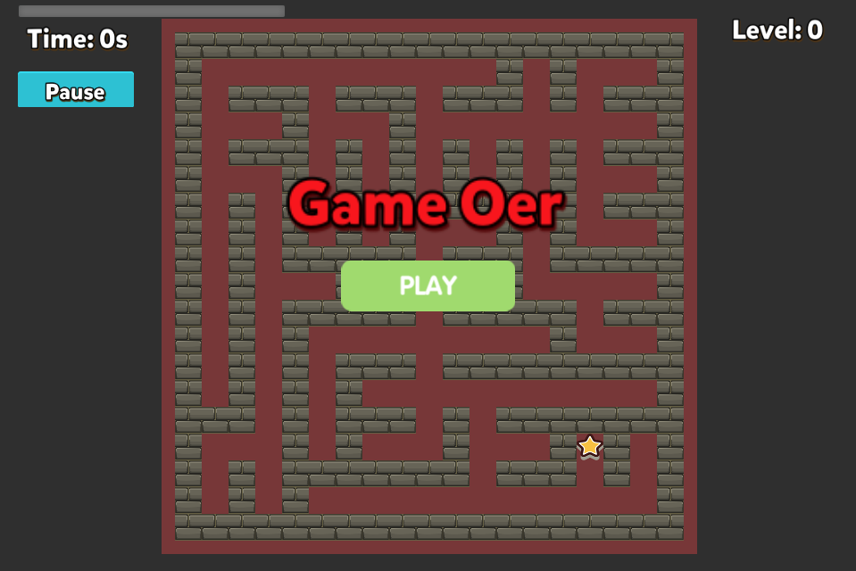

**Read this in other languages: [English](README.md), [中文](README_zh.md).**

# Introduction

I developed a maze game based on the Cocos Creator beginner project [Star Catcher](https://github.com/cocos-creator/cocos-tutorial-first-game).

The maze generation is inspired by the ideas from [liuyubobobo/Play-with-Algorithm-Visualization](https://github.com/liuyubobobo/Play-with-Algorithm-Visualization/tree/master/06-Maze-Generalization) and [Imymirror/maze-generalization](https://github.com/Imymirror/maze-generalization). It uses the BFS (Breadth-First Search) algorithm to non-recursively generate a random maze map.

# Development Environment

- Operating system: MacOS
- Game engine: [Cocos Creator 2.4.7](https://www.cocos.com/creator)
- Programming language: TypeScript

# Main Features

### Feature 1: Maze Generation and Display

Maze size: 19 x 19


### Feature 2: Character Movement Control


### Feature 3: Level Tracking and Game Over

- If the character reaches the finish point before the countdown ends, the maze will be regenerated, and the level will be reset after updating the completion count.

- When the countdown ends and the character has not triggered the finish point's collision callback, the game will result in a Game Over.



# Development Challenges

### Challenge 1: Character movement step size

You can use `cc.Tween` to ensure the character moves a fixed step size each time. Since the character and the path have equal widths, calculating the x and y values of the node based on time in `update()` might cause the character to not correctly enter the path (even a 1px difference could block the character by the wall), increasing the game difficulty.

### Challenge 2: Random maze

Using a Queue to generate the maze should produce the same maze every time. You can refer to [Imymirror](https://github.com/Imymirror/maze-generalization)'s implementation to introduce randomness when popping the queue, avoiding the repetition of generated mazes.

### Challenge 3: Reusing bricks

If you want to keep track of the number of completions, you can't simply reload the scene to start a new game. Therefore, the entire maze must be manually rebuilt. You can use `NodePool` to reduce the need to repeatedly instantiate & destroy bricks.

# LICENSE

```
Apache License

Copyright 2024 github-username: billyjojojobulido

Licensed under the Apache License, Version 2.0 (the "License");
you may not use this file except in compliance with the License.
You may obtain a copy of the License at

    http://www.apache.org/licenses/LICENSE-2.0

Unless required by applicable law or agreed to in writing, software
distributed under the License is distributed on an "AS IS" BASIS,
WITHOUT WARRANTIES OR CONDITIONS OF ANY KIND, either express or implied.
See the License for the specific language governing permissions and
limitations under the License.
```
