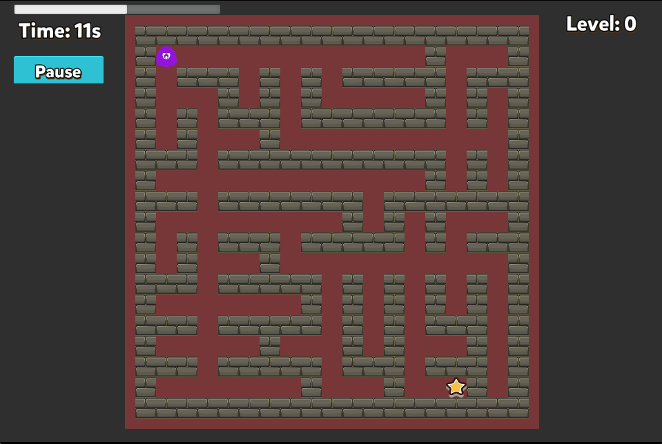
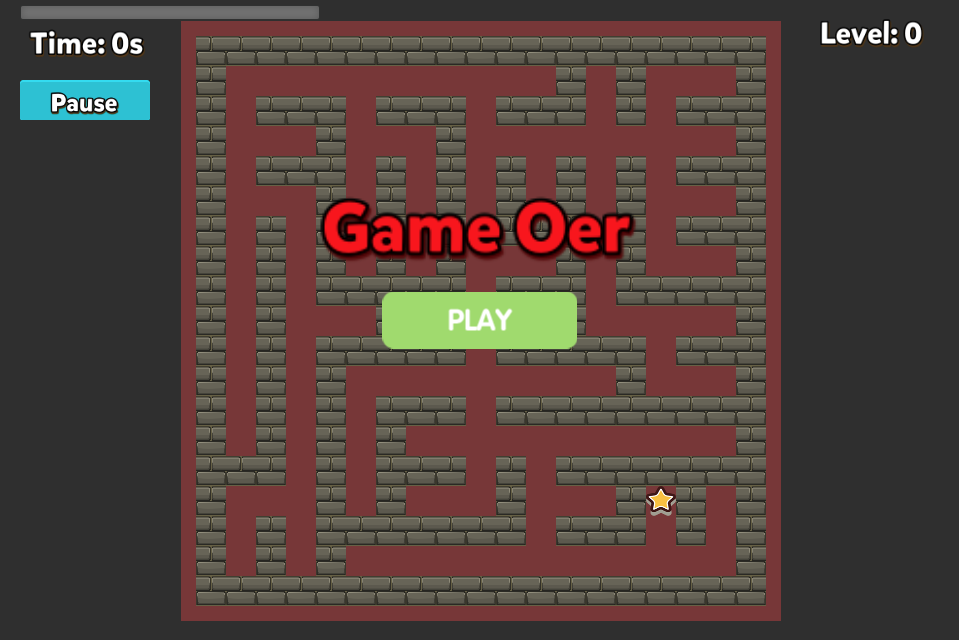

**Read this in other languages: [English](README.md), [中文](README_zh.md).**

# 简介

我在 Cocos Creator 新手项目 [Star Catcher](https://github.com/cocos-creator/cocos-tutorial-first-game) 的基础上，开发了走迷宫的游戏。

迷宫的生成则借鉴了
[liuyubobobo/Play-with-Algorithm-Visualization](https://github.com/liuyubobobo/Play-with-Algorithm-Visualization/tree/master/06-Maze-Generalization) 和 [Imymirror/maze-generalization](https://github.com/Imymirror/maze-generalization) 两位大佬的思路，采用的是 BFS(Breadth-First Search) 广度优先算法来非递归地生成随机迷宫地图。

# 开发环境

- 操作系统: MacOS
- 游戏引擎: [Cocos Creator 2.4.7](https://www.cocos.com/creator)
- 编程语言: TypeScript

# 主要功能

### 功能一：生成迷宫并显示

迷宫大小: 19 \* 19



### 功能二：人物的移动控制


### 功能三：关卡记录和游戏结束

- 若人物在倒计时结束之前，碰撞了终点，则会在更新通关数后重建迷宫，并重置关卡。

- 当倒计时结束时，游戏人物仍未触发终点的碰撞回调函数，就会导致游戏结束 (Game Over)。



# 开发难点

### 难点一：角色移动步长

可以使用 cc.Tween 来确保角色每次移动固定步长, 因为角色和路径的宽度都是相等的，update()中根据时间计算节点 x,y 的值有可能会导致无法正确进入路径(差 1px 也会被墙挡住)，增加游戏难度。

### 难点二：随机迷宫

使用 Queue 来生成迷宫正常来说应该每次都一样，可以参考[Imymirror](https://github.com/Imymirror/maze-generalization)的实现在 pop 队列的时候引入随机性避免每次生成的迷宫重复。

### 难点三：回收砖块

如果想要记录通关次数，就不能通过反复 loadScene 的方式来重开一局，因此需要手动 rebuild 整个迷宫，可以借助 NodePool 来减少砖块被反复 instantiate & destroy。

# LICENSE

```
Apache License

Copyright 2024 github-username: billyjojojobulido

Licensed under the Apache License, Version 2.0 (the "License");
you may not use this file except in compliance with the License.
You may obtain a copy of the License at

    http://www.apache.org/licenses/LICENSE-2.0

Unless required by applicable law or agreed to in writing, software
distributed under the License is distributed on an "AS IS" BASIS,
WITHOUT WARRANTIES OR CONDITIONS OF ANY KIND, either express or implied.
See the License for the specific language governing permissions and
limitations under the License.
```
